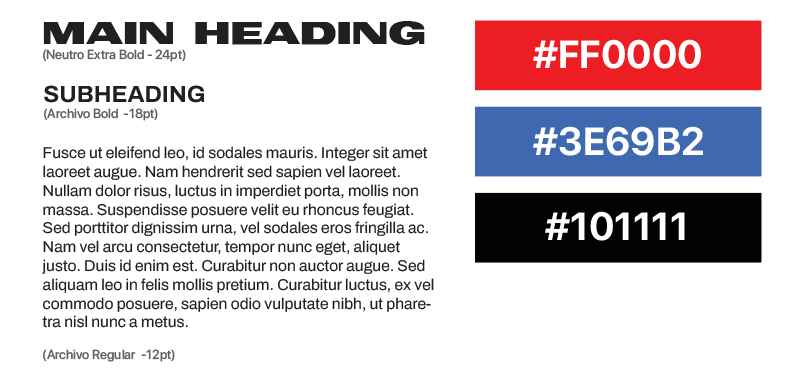
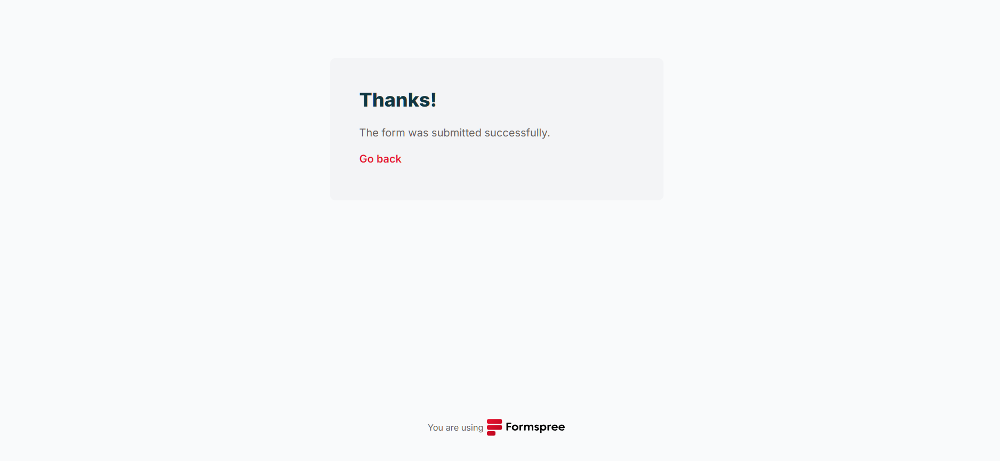

# Portfolio

Link to [Figma Mockup](https://www.figma.com/file/AlZktwdZF1Wq0SUR1rDvBk/ramelb_gian_prototype?type=design&node-id=0%3A1&mode=design&t=qTUOXMbdtlvdTDFJ-1)

## Background

January 2024 - In our User Experience Design class, we were informed that the final project for the term will be the final prototype of our portfolio website. We started with our own proposals, so in my case I tried to combine my graphic design, web design and development, and photography projects to give a flexibility on what I can offer based from what I learned from the Interactive Media Design program. 

### Moodboard
 

To define the mood of my site, I have described my look and feel to be enthusiastic, conventional, informative. I emphasize being dynamic on the product I give, the message we want to bring to everyone. Being conventional is to be reliable for the market, gaining trust that seeks stability. And last, being informative, offering a transparent and educational approach as we guide our potential market through our offerings and values.
With this words, I have associated a specific shade of red, blue, and black. 

My choice of heading font would be Neutro, and Archivo for the body. I used mostly sans serif fonts for my website so regardless of how big or small the screen the user has, it will still be readable.

## Prototyping

The creation started when our professor from the UX Design class tasked us to do the low fidelity wireframe. The reason for this minimal design is that I have contents that will likely compete my website design that is why I opted not to give too much elements.

Attached below is the image for my low fidelity prototype

Come to a time that we're done with the high fidelity layout, we had the chance to show it to our classmates and get their feedback what to remove or retain. I honestly had a feeling that the cards below the banner is overwhelming or too much elements, someone had suggested that I remove the buttons as clicking the image can already lead the users to the projects' link. So I decided to remove it, and improve the header as the nav links were smaller on the low-fidelity prototype.

Here's the final look before I do coding.

## And now the coding part...

As I have said earlier, the design is not too much complicated but I have too much pages because most of it were dedicated for categories, and also write-up explanations for individual projects specifically for graphic design and web development. I have to code first the page for each project since it has the simplest design but other than that, it has to be repeated at least nine times. 

### File linking
This is my first problematic encounter when I am on my early stage of coding my projects page. I have already finished the layout and pushed the code to my GitHub repository. Local render was fine but when I tried to enter the github pages link, my layout and images didn't render although I believed that time that all assets were linked properly to my HTML files. 

I tried to read some internet discussions regarding github pages, consulted our mentor and find out that I missed a detail. When it comes to linking and my file is in a subdirectory, it is required to do e.g. `../css/styles.css` since it is a relative path hence the browser will be able to find it and apply my styles and image assets to the page. This applied also when I linked my cards and navigations and it made me confuse somehow because I have to locate all of page and assets from their respective folders to properly link them and able to render to GitHub pages.

### Form and Formspree
The form is styled through Bootstrap but 
I tried using [Formspree](https://formspree.io/) &#40; This is not required although I want to make this work just incase I'll be distributing my portfolio to potential networks. &#41;to make my form active. So everytime someone attempts to fill up the form on my contact page, they'll be able to send me the message because of this. I just have to access my Formspree account so I will be able to see their message. 

1) So in this example, I am trying to type a sample message on the form.

2) Once you hit the `Send` it will direct you to the confirmation page.

3) Then on my backend > which is the Formspree dashboard, I will be able to see there who sent a message to me.

### Image Sizing
For image cards, I have to manually set their sizes through Photoshop. The reason for this one is to have the same sizes for all of images regardless if it's on categories, or if it's for the projects' card.

### Element Inspector
The best tool I have learned during this semester is the Element Inspector. It made my work easier because I can manipulate element styles right away. For example, if I have to modify my image's border-radius at least the corner will not be sharp looking, so I give an initial value for `border-radius` by `5px` and I play around by adding and subtracting until I get the desired look I want and I copy-paste the value from the inspector to my code.

## Bootstrap 
### Navigation
The Bootstrap framework concept is still new to me but it amazes me on how it lighten the work given to me, the ease of navigation styling and making it responsive helped me a lot since there are a lot of things to learn still especially the functionality of hamburger icon since it will be done with Javascript. 

### Grids
I am amazed at how the bootstrap grid works. It is flexible and auto layout was able to help me because I am not adding custom CSS just to assign grid styles for mobile and large screen queries. Assigning breakpoints to class names enabled me to achieve the style I wanted for my webpage. Photo masonry layout is also courtesy of the Bootstrap grid - I just have to modify the class naming to `col-lg-4 col-md-6 col-sm-12` for me to have a photo grid on my photography page. Another reason also why I gave this class for my photo grid is because the photo grid will be on a one long scroll for mobile, two column grid will be applied for tablet screens, and three column grid will be applied for desktop screens.

### Modifying Bootstrap Colors
I honestly thought that modifying colors from Bootstrap framework will be likely as simple as giving the value directly to the custom CSS stylesheet. But I learned that I have to retrieve the `root` property from the `inspect` option of the browser just to modify and apply my desired color value for the element I modified.

## Schema/Meta Description
Meta descriptions are visible for every page of this website so it will contribute to a search engine's understanding. On the other hand 
Schema was only implemented to my projects "To The Stars" and "Honey" the reason for this one is that it features other people that I had the chance to work with as well so this is a way for search engine to see specific content of the webpage.

## Disclaimer

### Honey lyric video
All assets used are courtesy of the original artist [rienne](https://open.spotify.com/artist/4TvZ190CDevLDBByQ5pXTP?si=DNiCMYFWRGG6nfAtdQ1tlg). I was tasked only to do animation and some marketing materials following the release of their song [honey](https://open.spotify.com/track/1xTUoJEXH6CSp1HyABuJOS?si=00384dcaf2f34160).

### To The Stars
All assets used are courtesy of the director of [Destiny music video](https://www.youtube.com/watch?v=QJ-NmQMSr30&pp=ygUNZGVzdGlueSBhc3Rlcg%3D%3D), William Capistrano. The music label gave me the permission to use their existing resources to design a cover art that would resemble to the identity of the band [ASTER](https://open.spotify.com/artist/5vskR6Pc4j5c9ydoawy0Tz?si=ALuLmvOlSLWbwIIXjYlHFQ). 

### Codewell Mockup Pages
The **Spense landing page** and **Web Developer Portfolio** mockup page are courtesy of the Codewell module. Codewell is my website to go when I was doing some practice. Just like the [FrontEndMentor](https://www.frontendmentor.io/challenges),they supply mock up pages and website that enable beginners like me to practice HTML and CSS. Unfortunately, Codewell's website was taken down that is why I cannot link my project to the original mock-up module.

### Photos
All photos in the photography section are mine. They are combination of my photowalks, volunteer for music gigs, and outputs that were done during our Introduction to Photography class.

## Assets used

**Frameworks**
- [Bootstrap](https://getbootstrap.com/)
- [Animate on Scroll](https://michalsnik.github.io/aos/)
- Back to Top button - Courtesy of [MDBootstrap](https://mdbootstrap.com/snippets/standard/mdbootstrap/2964350)
- Image masonry layout (reference) courtesy of [Infinite Scroll](https://infinite-scroll.com/demo/masonry/)
- Syntax highlighting courtesy of [Highlight JS](https://highlightjs.org/)

**Fonts**
- Icons courtesy of [BoxIcons](https://boxicons.com/)
- Neutro font courtesy of [CDN Fonts](https://www.cdnfonts.com/neutro.font)
- Archivo font courtesy of [Google Fonts](https://fonts.google.com/specimen/Archivo?query=archivo)

**Additional Resource**
- [FreeWebToolKit](https://freewebtoolkit.com/html-encode) to encode plain HTML to Encoded HTML